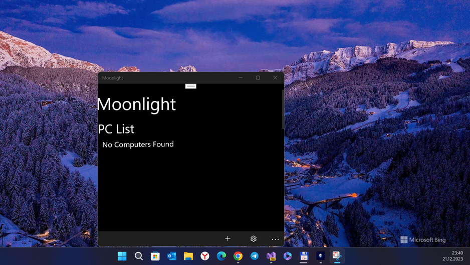

# Moonlight-uwp csharp-only branch 

Moonlight-Windows RnD

## About the original
Moonlight-Windows is the (a) famous "Video Screen streaming service". 
Sadly, its W10M developing stopped... No new features. I am interesting in NVidea tech. :)

## Screenshot(s)

## My 2 cents
- Moonlight Micro-RnD (Fast code/architecture research)
- Moonlight-common-binding C++ -> C# code "rebase" ("refactor.") - 5 % ready  

## Result
- Draft / Damaged
- I haven't much time... but I'm still trying to complete my strange "Moonlight uwp reburn" idea

## References / License
- https://github.com/moonlight-stream/moonlight-windows GameStream client for Windows Phone (Discontinued)
- MIT

## ..
As is. No support. RnD only. DIY

## .
[m][e] 2023

