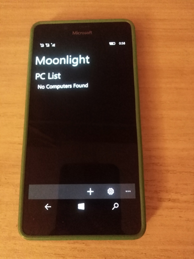

# Moonlight-UWP v1.0-alpha - cpp branch

My RnD of archived [Moonlight-Windows](https://github.com/moonlight-stream/moonlight-windows) project.

## About 
Moonlight Windows development is on hold until Windows apps support real time streaming of raw h264. We will provide any updates if this changes. We're sorry for the inconvenience and hope that we can get this up and running as soon as possible.

## Screenshot(s)

## My 2 cents
- Moonlight Micro-RnD (Fast C# code research)
- Moonlight-common-binding (C++ code tweaked a little)

## A few words about the original Moonlight-Windows project
Note: Moonlight Windows is in development and is not considered stable. 

Moonlight is an open source implementation of NVIDIA's GameStream, as used by the NVIDIA Shield.
We reverse-engineered the Shield streaming software, and created a version that can be run on any Windows 10 (Mobile) device, in theory. :) Moonlight Windows is built on the Windows Runtime (WinRT). 

Moonlight will allow you to stream your full collection of games from your PC to your Windows or Windows Phone device,
in your own home, or over the internet.

## Features
* Streams any of your Steam games from your PC to your Windows device
* Automatically finds GameStream-compatible PCs on your network

## TODO (Features in development)
* Keyboard and Controller support

## Installation
* Moonlight Windows is in development and not yet available for free download in the Store. If you want to try it in the meantime, download the source and deploy the app to your phone. 
* Download [GeForce Experience](http://www.geforce.com/geforce-experience) and install on your Windows PC

## Requirements
* [GameStream compatible](http://shield.nvidia.com/play-pc-games/) computer with GTX 600/700 series GPU
* PC, Windows tablet, or even Windows phone running Windows 10 Mobile 10240 or higher... =) 

## Usage
* Turn on GameStream in the GFE settings
* If you are connecting from outside the same network, turn on internet
  streaming
* When on the same network as your PC, open Moonlight and tap on your PC in the list and then tap "Pair With PC"
* Accept the pairing confirmation on your PC
* Try to play some games remotely :)

## Contribute 
- Fork it and set up a solution in Visual Studio 2022 
- Add [Moonlight Common](https://github.com/moonlight-stream/moonlight-common-c) as a project in your solution
- Write code
- Send Pull Requests

## Status / TODO
- Connection to RemotePC brocken (obsolete?)
- Compare moonlight-windows and [moonlight-xbox](https://github.com/TheElixZammuto/moonlight-xbox) projects
- Create PoC / MVP

## References to Authors / License
- [Moonlight-Windows](https://github.com/moonlight-stream/moonlight-windows) project (archived)
- [Michelle Bergeron](https://github.com/mrb113)
- [Cameron Gutman](https://github.com/cgutman)
- MIT

## .
As is. No support. RnD only. DIY.

## ..
[m][e] 2024
